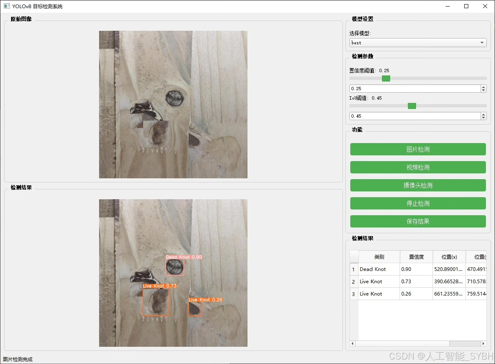
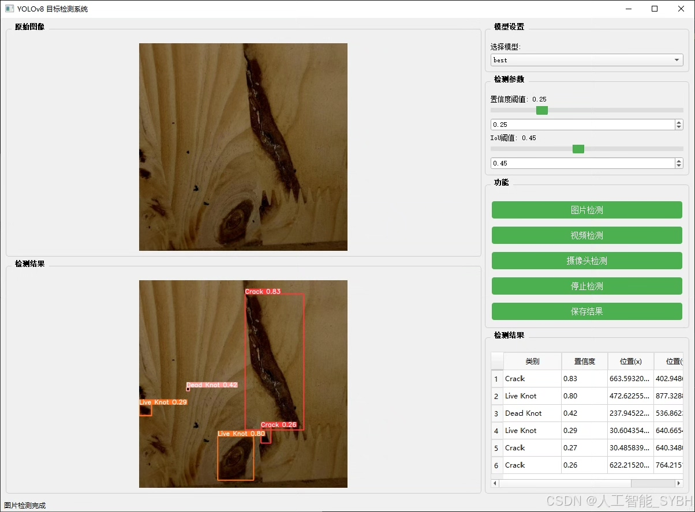
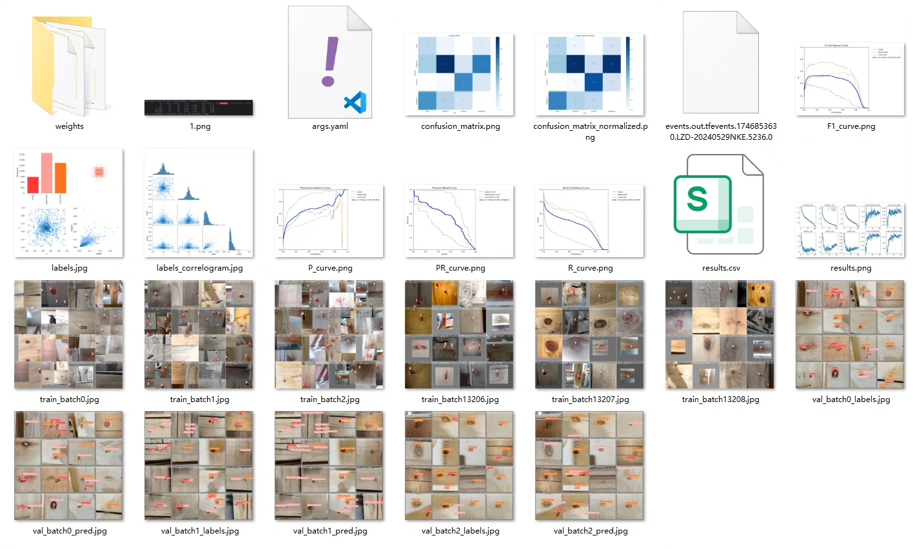
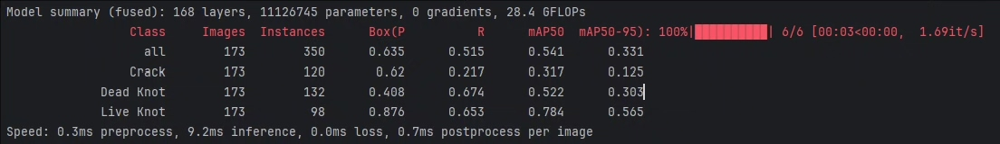
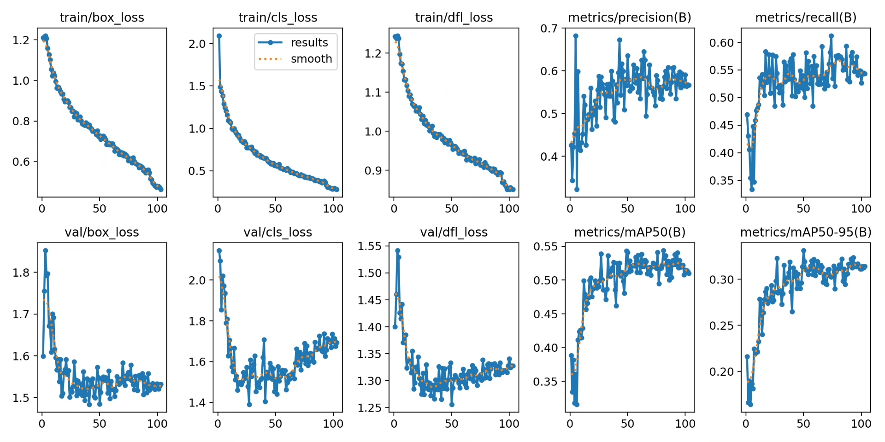
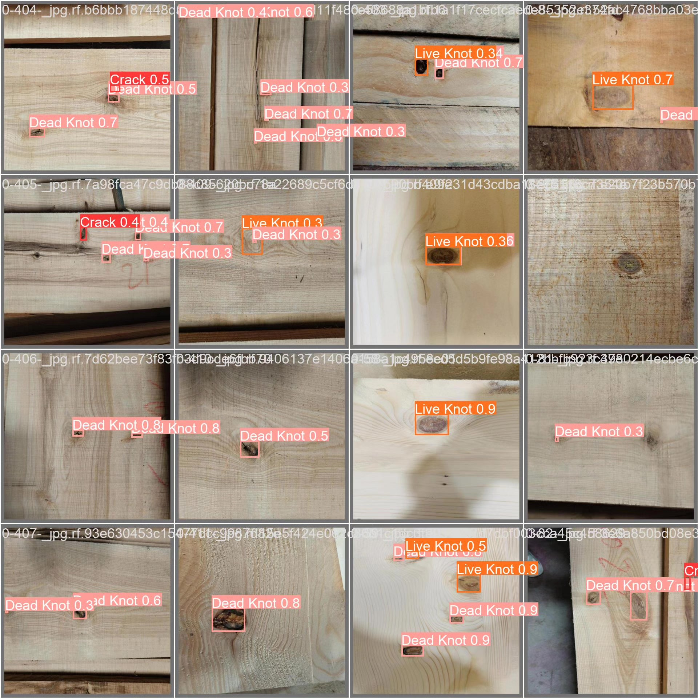
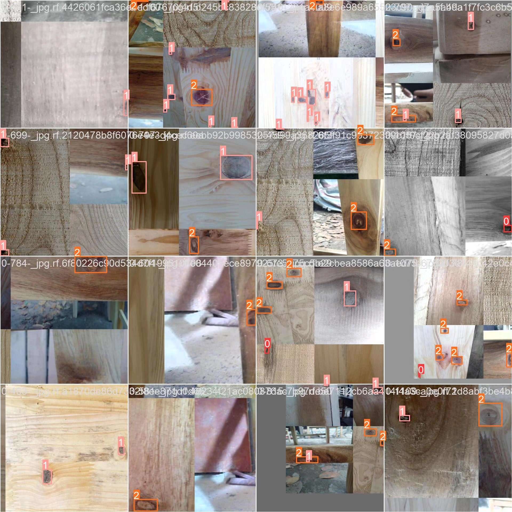

# Wood defect detection system based on deep learning YOLOv8+Y

## Body

Based on the advanced YOLOv8 object detection algorithm, this project has developed an efficient automatic wood defect detection system. It aims to achieve rapid and accurate recognition and classification of common defects on the surface of wood (cracks, dead knots, live knots). The system is centered around deep learning technology, training a dataset containing 2,259 labeled images to construct a robust detection model. Performance verification was conducted on both the validation set (173 images) and test set (174 images). Experiments show that the system can effectively adapt to the complex texture and diversity of defects on wood surfaces, providing an automated quality inspection solution for the wood processing industry. This significantly improves detection efficiency and accuracy, reducing labor costs and false-positive rates.

The company's products have obtained YOLO official commercial license certification.

We offer after-sales service.

After payment, we will provide WeChat ID for any questions.

Environment configuration: A tutorial on environment setup will be provided, with WeChat available for Q&A.

Remote installation service: For remote configuration, an additional fee of 69 is required. If the configuration fails, all fees are refundable (excluding special old computers only refunding installation fees).

Retraining dataset: After setting up the environment, you can train on your own computer. If you need us to retrain, just pay 69 plus computing power fees (2.5 yuan/hour).

Full after-sales service

## Images

## Payment

Here is a pay link on Stripe ( https://buy.stripe.com/3cs8yP7sY87d0vu9AB ). Please contact me lonlonago@foxmail.com after funding $89, and I will send you a complete data files , thank you!

